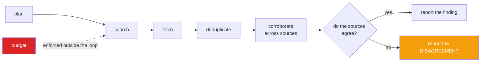

<h1 align="center">deep-research-agent (Python · source dedup · claim verification)</h1>
<p align="center"><i>A research agent that tells you when the sources disagree, instead of picking one</i></p>

<p align="center">
  <a href="#three-things-most-research-agents-get-wrong">Three things</a> &middot;
  <a href="#the-budget-is-outside-the-loop">The budget</a> &middot;
  <a href="#source-authority">Source authority</a> &middot;
  <a href="#usage">Usage</a> &middot;
  <a href="#limits">Limits</a> &middot;
  <a href="#problems-hit-while-building-this">Problems hit</a>
</p>

<p align="center">
  <a href="https://github.com/hammasbuilds/deep-research-agent/actions/workflows/ci.yml"></a>
  
  
  
  <a href="LICENSE"></a>
</p>

---

## Three things most research agents get wrong



**The budget sits outside the loop**, so the agent cannot reason its way past it. And when
sources conflict, the disagreement *is* the output - most research agents silently pick one.

Search and fetch are injected, so the whole pipeline is testable **with no network and no
model**.


### 1. Ten sources is not ten sources

A wire story is republished verbatim by dozens of outlets. An agent that counts URLs
reports *"corroborated by 12 sources"* about a claim with exactly one origin — and the
confidence it reports is **fabricated**.

Near-duplicates are collapsed *before* anything is counted, using hashed word-shingles,
and the unit of corroboration is an independent source:

```
5 documents fetched  →  3 independent sources  (independence ratio 0.6)
reuters.com ........... copies_found: 3   ← dawn.com and a blogspot mirror
```

The **highest-authority** copy represents its group, not the first one seen. If a wire
story appears on both the agency and an aggregator, the agency is what gets cited — the
order results arrived in is not evidence about anything.

Claims are extracted from the representative only. Extracting from every copy would let
one story contribute the same claim a dozen times and manufacture exactly the
corroboration deduplication just removed. That's a test.

### 2. Disagreement is the finding, not a problem to resolve

A typical agent feeds every document to a model and asks for a summary. When the
documents conflict, the model silently picks one — and the conflict, which was the most
useful thing the research turned up, disappears.

```python
report.disputed
# [{"subject": "Inflation in Pakistan",
#   "values": [8.2, 12.4], "spread": 0.41, "confidence": "disputed",
#   "citations": [{"source": "reuters.com/a",    "quote": "...was 8.2 percent..."},
#                 {"source": "worldbank.org/d",  "quote": "...was 12.4 percent..."}]}]
```

Agreement is separated from dispute in the report, and confidence comes from
**corroboration count, not tone**:

| | |
|---|---|
| `disputed` | sources conflict — capped regardless of how many are on each side |
| `well-corroborated` | 3+ independent sources |
| `corroborated` | 2 |
| `single-source` | 1 |

Ordinary measurement variation is *not* a contradiction — 8.2% and 8.4% corroborate each
other; 8.2% and 12.4% do not. The tolerance is explicit and tested both ways.

Consensus is the **median**, and on an even count `statistics.median` averages the middle
pair. Taking `ordered[n // 2]` would silently prefer the higher of two disagreeing
sources — a bias dressed up as a tie-break. That was a real bug here.

### 3. Every quote is verified against the fetched text

```python
def test_a_fabricated_quote_is_rejected():
    """A citation the agent wrote from memory is worse than no citation,
    because it looks like evidence."""
```

Whitespace-insensitive, otherwise **exact**. A near-miss is a miss — a fuzzy threshold is
precisely where fabricated quotes slip through. Dropped quotes are counted in the report
rather than hidden.

## The budget is outside the loop

Research is unbounded by nature: there is always one more source. So the stopping
condition comes from somewhere the agent cannot influence — queries, fetches, wall clock.

It also **stops when it has enough**. Research that can't stop once the question is
answered is as broken as research that can't stop at all:

```
"stopped_because": "found enough corroborated evidence"
"stopped_because": "fetches budget exhausted: 20 of 20"
```

And planning always includes a **contrary query**. An agent that only searches for
confirmation will find it.

## Usage

```python
agent = ResearchAgent(search=my_search, fetch=my_fetch, min_authority=0.6)
report = agent.run("What is inflation in Pakistan?")

report.summary()
# {"findings": 2, "disputed": 1,
#  "independent_sources": 3, "documents_fetched": 5, "independence_ratio": 0.6,
#  "unverified_quotes_dropped": 0,
#  "stopped_because": "found enough corroborated evidence"}
```

`search(query, limit) -> [url]` and `fetch(url) -> Source` are yours. Plug in Tavily,
Brave, SerpAPI or a local index — the agent does not know or care, which is why it can be
tested exhaustively without one.

---

## Input


## Output

`python demo.py`


*Two of the five pages are the same wire story. Counted naively that is three sites
agreeing on 2100 GW; after deduplication it is one source, and the independence ratio
drops to 80%.*

*The 1600 GW figure is not dropped for being the minority view. The finding is returned
as a disagreement with a 27% spread, because a user asking this question is far better
served by "the sources do not agree" than by a confident single number.*

---

## Source authority

A coarse prior on reliability, from the domain: primary research → official → established
press → reference → commercial → user-generated. Deliberately coarse, because a finer
taxonomy would imply precision this heuristic does not have.

**It is a weight on evidence, never a substitute for checking it.** A high-authority
source saying something no other source says is still a single unverified claim, and the
report says so.

## Tests

**48 tests. No network, no API key, no model.**

| Covered | |
|---|---|
| Authority | five domain classes, research outranks blogs, unknown domains untrusted |
| Deduplication | copies collapse, highest-authority representative, distinct docs stay apart, independence ratio, shingling edges |
| Extraction | numeric claims, unit scaling (2 billion = 2000 million), comma parsing, negation, whole-sentence quotes |
| Corroboration | agreement, dispute, measurement variation ≠ contradiction, **median consensus**, opposing stances, disputes sort first |
| Planning | contrary query always present, quantitative and comparative shapes, dedup and cap |
| Verification | exact match, whitespace tolerance, **fabricated quote rejected**, near-miss is a miss |
| Agent | agreement/dispute separated, **copies do not corroborate**, query and fetch budgets, early stop, dead links, authority floor, empty results |

## Limits

- **Claim extraction is pattern-based.** It catches numeric and simple assertional
  claims and little else. That is a real ceiling on recall — but it is deterministic,
  inspectable, and it means the corroboration logic is verifiable without an API key. A
  model-based extractor fits behind the same `Claim` interface.
- Contradiction detection is numeric and stance-based. Two sources disagreeing about
  *causation* in prose will not be caught.
- Deduplication is lexical. A story rewritten in different words reads as independent
  when it is not — the hardest case, and it needs semantics.
- Domain authority is a heuristic, not a reputation system, and it encodes assumptions
  worth arguing with.
- No synthesis prose. The report is structured findings with citations; turning that
  into readable narrative is a model's job, and it should be given *verified* findings
  rather than raw documents.

## Keywords

research agent &middot; deep research &middot; multi-source corroboration &middot; source conflict detection &middot; citation verification &middot; deduplication &middot; budget enforcement &middot; agent loops &middot; dependency injection &middot; testable agents &middot; httpx &middot; zero dependencies &middot; LLM agents &middot; information retrieval

## License

MIT

---

## Run it yourself

```bash
git clone https://github.com/hammasbuilds/deep-research-agent
cd deep-research-agent

pip install -e .         # core has zero dependencies
pytest -q                # 48 tests, no network, no API key, no model
```

Search and fetch are injected, so the whole agent runs against anything — Tavily, Brave,
SerpAPI, or a local index:

```python
from research import ResearchAgent, Source

def search(query, limit):  return my_search_api(query)[:limit]
def fetch(url):            return Source(url=url, text=download(url))

agent = ResearchAgent(search=search, fetch=fetch, min_authority=0.6)
report = agent.run("What is inflation in Pakistan?")

report.summary()    # independence ratio, dropped quotes, why it stopped
report.disputed     # where sources conflict, with both figures and both citations
report.findings     # where they agree, with confidence from corroboration
```

## Problems hit while building this

**Consensus preferred the higher of two disagreeing sources.** Taking `ordered[n // 2]`
as the median works on odd counts and silently picks the upper value on even ones — so
with exactly two sources reporting 8.2% and 12.4%, the "consensus" was 12.4%. A bias
dressed up as a tie-break, and the sort of thing that would never be noticed in a report.
*Fixed* with `statistics.median`, which averages the middle pair, and that is now a test.

**Counting sources was counting copies.** The first version reported "corroborated by 4
sources" for a wire story that Reuters wrote and three other sites republished verbatim.
The confidence figure was fabricated. *Fixed* by collapsing near-duplicates with hashed
word-shingles **before** anything is counted, and by extracting claims from the group's
representative only — extracting from every copy would manufacture exactly the
corroboration deduplication just removed.

**The planner only searched for confirmation.** Decomposing a question into sub-queries
naturally produces queries that look for supporting evidence, which is how an agent
concludes whatever it started with. *Fixed* by always appending a contrary query.
